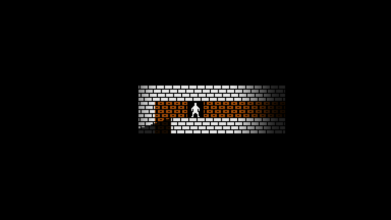
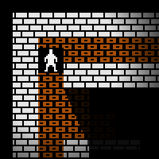
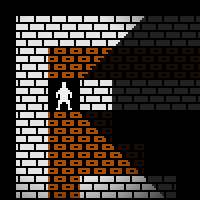

# Godot 2D tile lighting and visibility demo

This project demonstrates an approach for integrating the Godot 2D lighting
system with traditional/roguelike 2D tile-based visibility.

Techniques on show:

- Tile-based gross visibility
- Dynamic light occlusion reflecting tile visibility
- Dissipating terrain fog of war
- Persistent light-derived detail fog of war

## Warnings

I’m just playing around with Godot and have not yet written even a single
complete game.  Undoubtedly several of the specifics or even general approaches
of this demo are suboptimal or entirely inappropriate for a real project.
Although a few of the contained classes may be re-usable in other projects, this
project as a whole is only intended to demo certain techniques, not provide a
complete framework for applying those techniques on arbitrary projects.

## Problem

The problem we want to solve is that of integrating the “traditional” 2D tile
geometries of games like Rogue or Ultima with Godot’s 2D lighting system.  As a
newbie dabbler it seemed like it shouldn’t be that difficult.  Godot has a
TileMap node, and tiles in a TileSet can provide a light occlusion polygon.
Surely it must just be a matter of jiggering cull modes and range masks until
everything looks like we want.  Right?

Alas not.

Here’s what ends up happening, as demonstrated in two different questions on the
Godot Engine Q&A site:

> “So I guess I want some way of casting shadows from the back of the polygon,
> but for the light to still affect the wall tiles themselves...” – [How can I make tilemap walls with an occluder show and cast shadows?][q1]

> “The two wall tiles immediately up from the player are rendered correctly,
> however they are casting shadows on the other tiles in the scene, which should
> not be happening...” – [Implementation of 2D Shadow Culling for Player Line of Sight][q2]

[q1]: https://godotengine.org/qa/23818/how-can-make-tilemap-walls-with-occluder-show-and-cast-shadows
[q2]: https://godotengine.org/qa/35474/implementation-of-2d-shadow-culling-for-player-line-of-sight

And here’s what we want, as implemented in this project.  We have the same row
of wall tiles viewed/lit from two different angles: the first obliquely,
viewing/illuminating the entire row; and the second from parallel,
viewing/illuminating only the first tile.

| Oblique view         | Parallel view         |
| :---:                | :---:                 |
|  |  |

I left [an answer for the first of the above Q&A questions][answer] discussing
the problem and some potential solutions.

[answer]: https://godotengine.org/qa/23818/how-can-make-tilemap-walls-with-occluder-show-and-cast-shadows?show=81284#a81284

## Solution

In the intended effect, we only want to cast shadows from the “back” of a tile
if the tiles behind it are not visible.  This means that visibility determines
illumination and not vice versa!  Even if we want to further limit visibility
based on illumination, we need to know which tiles are visible first in order to
determine which ones should and should not cast shadows.

In order to achieve this, we need the following elements:

- Permissive tile-based visibility determination.  We need to find every tile
  light will touch given a particular occlusion policy so that we may then
  reflect that occlusion policy in the 2D lighting system.
- Dynamic light occluder placement.  We need to update the collection of light
  occluders to reflect the calculated visibility and occlusion.
  
This works okay for pure lighting, but not for visibility, especially not if we
want to have other lights elsewhere in the scene.  To achieve the full
visibility effect, we composite:

- An independently-rendered “fog of war” copy of the game world terrain.
  Rendering an independent copy of the terrain gives us complete control over
  which scene elements appear in the fogged display.
- A seen-tile mask, tracking which tiles of the level are seen versus unseen.
  This allows us to dissipate the terrain-level fog of war.
- A current visibility mask, tracking what the player can currently see.  This
  allows us to dissipate the detail-level fog of war.

### Tile-based gross visibility

The [`ShadowCaster`](ShadowCaster.gd) class implements basic tile-based
visibility using a version of the “shadow casting” algorithm described various
places ([1][sc1], [2][sc2], [3][sc3]).  This is probably one of the more
reusable pieces of code in this project, though the shortcut/optimization of
using floating-point slopes makes it only appropriate for relatively short
visibility ranges.

[sc1]: http://www.adammil.net/blog/v125_Roguelike_Vision_Algorithms.html
[sc2]: https://journal.stuffwithstuff.com/2015/09/07/what-the-hero-sees/
[sc3]: https://www.albertford.com/shadowcasting/

The exact choice of algorithm for this element probably doesn’t matter, but we
need it to match the behavior of the dynamic occluder.  This means the
visibility needs to be “permissive,” so that it properly propagates light
through any tile touched by light, and that the visibility algorithm needs to
use the same occlusion shapes as those generated by the dynamic occluder.

### Dynamic occlusion

The [`TerrainOccluder`](TerrainOccluder.gd) class implements dynamic occluder
placement in response to a player visibility signal.  It uses the VisualServer
APIs in order to place and remove occluders efficiently.  This class is almost
certainly not re-usable directly, but the code should be easy to modify for
other projects.

### Visibility compositing

The main [`FieldOfView`](FieldOfView.gd) scene and script implements terrain and
detail fog of war by compositing the final frame from a mixture of viewport
renders and generated textures.  Specifically:

- Node `WorldViewport` renders the main scene content.
- Node `FogViewport` renders a copy of just the level terrain.
- Node `VisibilityViewport` renders just a copy of the player light and copies
  of the terrain occluders in order generate a visibility mask.
- Texture array `_seen_texture` contains one pixel for each tile in the level.
  The `FieldOfView.gd` script flips pixels in the backing image from black to
  white as the player observes the tiles.  The array contains two layers, one
  updated as moves begin and the other after they end, supporting smooth visual
  transitions over the course of turn-based motion.

The final effect is generated with the [`fov_composite`](fov_composite.shader)
shader, which uses the visibility and seen-tile masks to choose among the
terrain fog, details fog, and real main scene for each pixel.

Compared to other approaches to achieving the same effects, this approach has
the following benefits:

- Visibility effects are independent of main content nodes.  Nodes in the main
  content do not need to implement any particular behaviors related to
  visibility.
- Visibility effects are independent of main content lighting.  Lighting in the
  main content all needs to work together to achieve any desired lighting
  effects, but visibility then layers on top of the final lit result without
  interfering with it.

## Notes

The visibility mask light is a `MODE_MIX` light.  The Godot [2D Lights as
Mask][light2d_as_mask] demo also uses `MODE_MIX` lights, despite the name.  This
drove me to distraction until I figured it out, because I couldn’t understand
why my `MODE_MASK` lights didn’t work like the ones I assumed the demo used.

[light2d_as_mask]: https://github.com/godotengine/godot-demo-projects/tree/master/2d/light2d_as_mask

Grepping through the Godot Engine code, as far as I can tell `MODE_MASK` is
essentially the same as `MODE_MIX`, except that light-pass pixels outside of the
bounds of the light texture keep their underlying color for `MODE_MASK` while
becoming entirely transparent for all other modes.  Hence `MODE_MASK` lights
mostly only have any effect within the bounds of the light texture, making them
more useful(?) for concealing rather than revealing.

The “mostly” part hides some deeply surprising behavior though.  Because the
light pass produces opaque colors for everything outside of the light mask, any
canvas items with “light only” material outside of the mask render as if they
have received full light!  Kind of explicable, but very confusing, and hardly
seems desirable.
